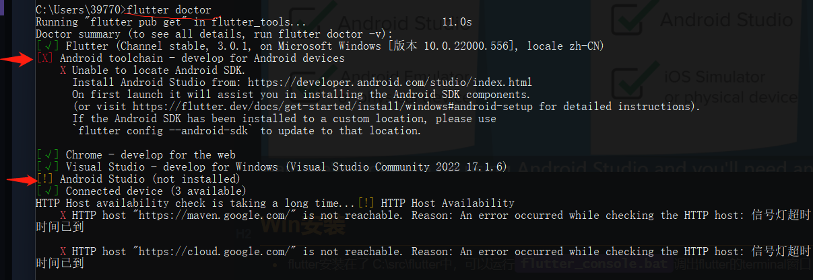
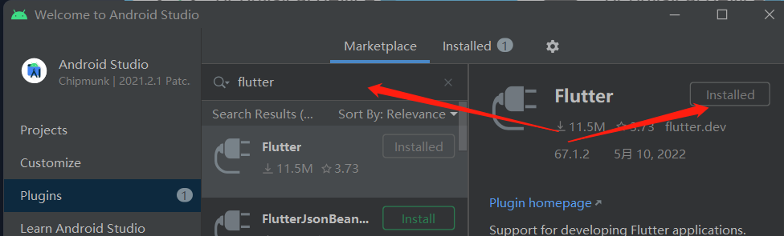
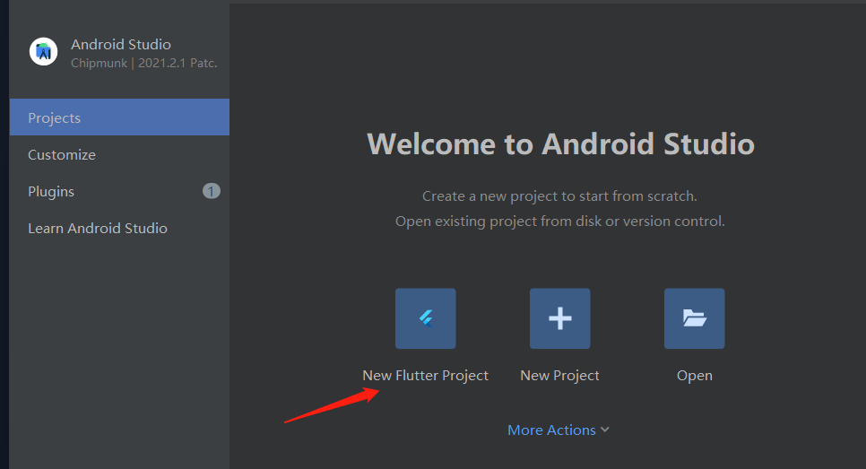

[docs.flutter](https://docs.flutter.dev/)

[android studio](https://developer.android.google.cn/studio)

Flutter 使用 dart语言

搭积木写应用

学习建议：

1. 先看完，然后理解，然后再敲代码
2. 记笔记
3. 好好思考问题

## Win安装flutter

* flutter安装在了 C:\src\flutter中，可以运行`flutter_console.bat`调出flutter的terminal窗口
* 将flutter的bin文件路径，添加到环境变量中
* 终端中`flutter --version`查看flutter版本，`flutter doctor`查看问题，我的问题目前如下：

## win安装安卓studio

[android studio](https://developer.android.google.cn/studio)

下载后安装，安装时候把插件安装，再启动后，再plugin搜索flutter，然后安装，安装完了重启。重启后如图二，就有创建新flutter项目按钮了

创建项目时候选的比较多，每条看仔细了。如果让选环境位置，记得是： c:\src\flutter\flutter