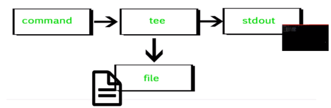
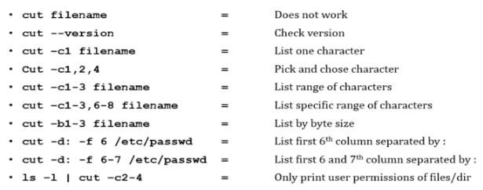
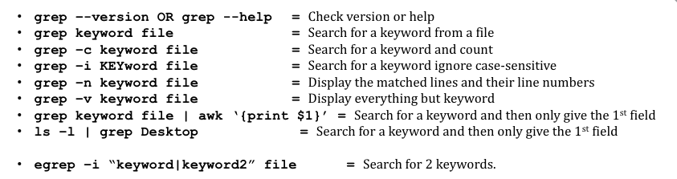
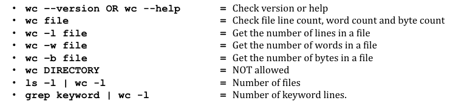
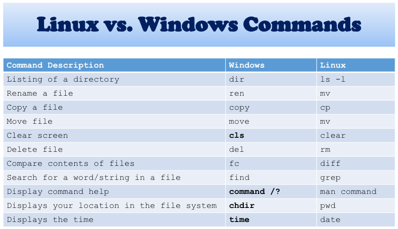

# 第1章 理解Linux概念

本笔记记录的是Udemy的课程笔记

> 什么是Linux？

Unix 1970   Linux1991

Linux mostly free   open source.

* Redhat 	企业级，not open source

* CentOS Free

* Fedora free 公司用

* Suse  定制系统
* debian
* ubuntu 

> 谁在用Linux？

- US Government Agencies
- NASA
- Health Care
- the bullet trains in japan runs at the speed of 150-215 ,/h 
- traffic control
- financial institutes e.g. NYSE
- world e-commerce leaders ,including amazon ebay paypal ...

# 安装虚拟机和linux

> 安装虚拟机

两种选择：

- 甲骨文的[virtual box](https://www.virtualbox.org/wiki/Downloads)   
- VMare

下载centos7：[download centos7](https://www.centos.org/download/)


9.5G，需要挂很久《centos-7-x86_64-everthing-2009》

# 操作和文件系统

```shell
// 查看文件
cat
// 查看电脑名
hostname
//查看本机ip地址
```

> 远程链接

1. 安装putty

2. 设置中将服务器修改如下内容


3. `ifconfig`查看ip，并进行链接，如果不是192.。。ip格式，可先输入`ifup enp0s3`

   默认端口22

4. Linux 区分大小写，尽量不随便敲空格

5. Linux is mostly CLI not GUI

6. Linux 非常有韧性

>  File system文件系统框架


> 文件介绍

`/boot`   contains file that is used by the boot loader
`/root`   root user home directory .it is not same as `/`
`/dev`     system device(e.g. disk cdrom speakers flashdrive keyboard etc.)
`/etc`     configuration files
`/bin `->`/usr/bin` everyday user commands
`/sbin`->`/usr/sbin`  system/filesystem commands
`/opt`     optional add-on applications(not part of OS apps)
`/proc`   running process (only exist in memory)
`lib`->`usr/lib`  C programming library files needed by commands and apps
`/tmp`     Directory for temporary files
`/home`   Directory for user
`/var`     system logs
`/run`     system daemons that start very early to store temporary runtime files like PID files
`/mnt`     to mount external filesystem (e.g. NFS)
`media`   for cdrom mounts


> 语法命令

|                          |                       |
| ------------------------ | --------------------- |
| `cd`        切换路径并进入 | `pwd`           显示当前路径 |
|`ls`        罗列文件 | `whoami`    查看当前用户名 |
|`su -`    切换到root用户|`clear`      清空屏幕|
| `ls -l` 带属性| `mkdir xxx`   创建文件夹   |
|`ls -ltr`   带顺序罗列|`cp aaa bbb`  复制aaa文件为bbb|
|`vi xxx`   创建内容写东西，`esc`-> `:wq!`保存退出|`passwd`  修改密码|
| `ln -s aaa bbb`链接两个文件    ln软连接，ln -s硬链接 | `chomd` 修改文件权限 |
| `chown` and `chgrp` | `cat` |
| `more` | `less` |
| `head` | `tail` |
| `cut` | `awk` |
| `grep` and `egrep` | `sort` |
| `uniq` | `wc` |
| `diff` | `cmp` |
| `tar` | `gzip` |
| `Gzip -d OR gunzip` |  |


> linux ls 后显示文件的类型

| file symbol | meaning |
| ----------- | ------- |
| - | Regular file |
| d | directory |
| l | link |
| c | special file or device file |
| s | socket |
| p | named pipe |
| b | block device |

> 查找文件和文件夹

`find`   find . -name asdf    举例如下


`locate`


> 系统颜色说明


# 文件权限

> 三种权限类型

- r -read
- w -write
- x -execute = running a program

> rwx三种权限可以被控制为三种权限

- u   - user = yourself
- g  - group = can be people in the same project
- o - other=everyone on the system

> help commands

- **whatis** command
- command **--help**
- **man** command

> 写入文件

- `echo "hello"  > jerry`  向jerry文件中写入hello
- `echo "hello2"  >> jerry`  向jerry文件中写入hello，新的一行

> input and output redirects

- stdin       0
- stdout    1
- stderr     2


> standard output a file (tee)标准输出到文件

- `echo "balabala" | tee xxxfile`   此命令将打印并将巴拉巴拉巴拉存到xxxfile中
- `echo "lala222" | -a tee xxxfile`   此命令将打印并lala2追加保存到xxxfile中
  

- 如使用`ls -l | tee listdir`  不仅打印出文件目录，而且将文件目录存入listdir文件中
- `wc -c xxxfile`  统计xxxfile中字符数量


* `cut`








### linux 对比 windows cmd 的指令



# 第五章 linux file editor

## 快捷指令包括 

> vi       --        visual editor.   
>
> 	- `i`        insert
> 	- `Esc`    escape out of any mode
> 	- `r`        replace 
> 	- `d`        delete
> 	- `:q!`    quit without saving
> 	- `:Wq!`   quit and save
>
> ed      --       standard line editor
>
> ex       --      extended line editor
>
> emacs   --   a full screen editor
>
> pico       --   beginner's  editor
>
> vim        --   advance version of vi