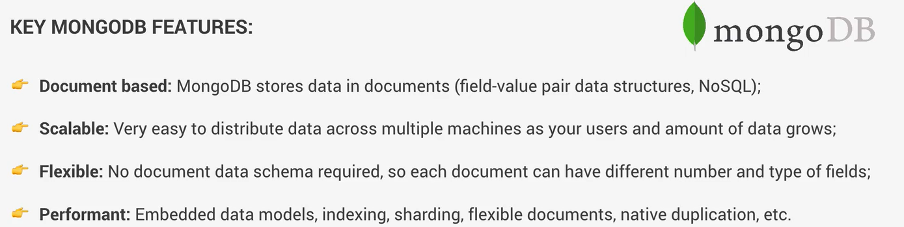

Udemy MongoDB课程笔记：

区分  `Databases`,`Collections`,`Documents`

```shell
//换端口启动mongodb
sudo mongod --port 27018 

//mongo 链接换端口
mongo --port 27018
```


```sql
-- 创建数据库
use natours-test  

-- 查找数据库
 show dbs
-- 显示数据库中表格
 show tables

-- 插入一个数据
db.tours.insertOne({name:"the forest hiker",price:297,rating:4.7})
-- 插入多个数据
db.tours.insertMany([{name:"the sea explore",price:498,rating:4.8},{name:"the snow adventurer",price:999,rating:3.9,difficulty:"easy"}])


-- 查找数据
// 查找全部
db.tours.find()    
db.inventory.find().pretty()   //查找漂亮排序，shell中用
// 按名字查找
db.tours.find({name:"the forest hiker"})   
// 安困难程度找
db.tours.find({difficulty:"easy"})    
// 查找价格小于500的
db.tours.find({price:{$lte:500}})  
// 查找价格小于500，评分大于等于4.8
db.tours.find({price:{$lte:500},rating:{$gte:4.8}})   
// 价格小于500 或 评分大于4.8
db.tours.find({$or:[ {price:{$lt:500}},{rating:{$gte:4.8}} ]})  
// 找到结果只显示name列
db.tours.find({$or:[ {price:{$gte:400}},{rating:{$gte:4.8}} ]},{name:1}) 
// 数据更新
db.tours.updateOne({name:"the snow adventurer"},{ $set:{ price:888 } })  
// 更新多个
db.tours.updateMany( { price:{$gt:500},rating:{ $gte:3.8 }},{$set :{premium:true}})  
// 替换文档

//所有数据增加字段
　db.table.update({}, {$set: {content:""}}, {multi: true}) //multi=true这个，可以修改多个数据，不加仅修改一个
-- 删除
现在有三个，(objectId缩略了)
{ "_id" : ObjectId("62...8"), "name" : "the forest hiker", "price" : 297, "rating" : 4.7 }
{ "_id" : ObjectId("62...f"), "name" : "the sea explore", "price" : 498, "rating" : 4.8 }
{ "_id" : ObjectId("62...0"), "name" : "the snow adventurer", "price" : 888, "rating" : 4.9, "difficulty" : "easy", "premium" : true }
// 删掉低于4.8分的
db.tours.deleteMany({rating:{ $lt:4.8   }})

--退出
quit()
```

MongoDB 的Atlas 可以创建数据库，然后免费500M。可以链接compress 也可以链接cmd

`mongosh "mongodb+srv://cluster0.vgy4362.mongodb.net/myFirstDatabase" --apiVersion 1 --username rovesoul `

开头改为`mongo` 链接之后同之前的操作一样


## 模块介绍

* Node中用mongoose 作为数据库操作模块