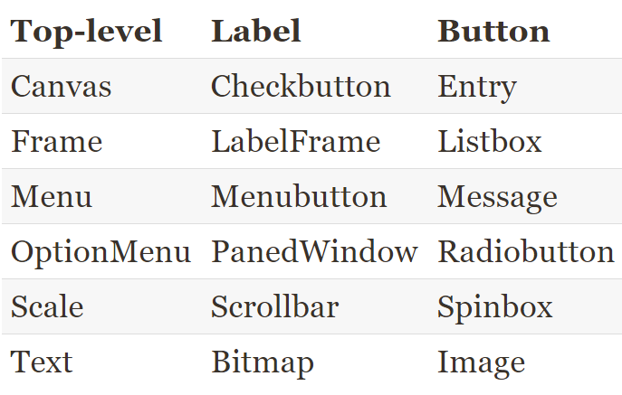

[Tk文档网址](https://tkdocs.com/tutorial/)

终端输入`python3 -m tkinter`可以调出一个tkinter的窗口进行演示。





## 示例：

以下默认已经输入以下内容：

```python
import tkinter as tk
from tkinter import ttk
```


### Entry 输入框

```python
# 输入框
my_entry = ttk.Entry(parent, textvariable=my_text_var)

"""
* parent: This argument sets the parent widget for the entry.
* textvariable: This is a Tkinter StringVar variable whose value will be bound to this input widget.
* show: This argument determines which character will be displayed when you type into the box. By default, it's the character you type, but this can be replaced (for example, for password entry you might specify * or dot to be shown instead).
* Entry: This widget, like all the ttk widgets, supports additional formatting and styling options. 
"""
```

### spinbox 增加减小框

```python
my_spinbox = tk.Spinbox(
    parent,
    from_=0.5,
    to=52.0,
    increment=.01,
    textvariable=my_double_var)

"""
* from_: This argument determines the lowest value to which the arrows decrement. The ending underscore is needed because from is a Python keyword; in Tcl/Tk it's just from.
* to: This argument determines the highest value to which the arrows increment.
* increment: This argument represents the amount at which arrows increment or decrement.
* values: This argument takes a list of string or number values that can be incremented through.
"""
```

### Combobox 选框

```python
combobox = ttk.Combobox(
    parent, textvariable=my_string_var,
    values=["Option 1", "Option 2", "Option 3"])
"""
"""
```

### checkbutton(单选勾选)

```python
my_checkbutton = ttk.Checkbutton(
    parent, text="Check to make this option True",
    variable=my_boolean_var)
"""
* text: This argument sets the label for the widget.
* variable: This argument is BooleanVar, to which the checked status is bound.
* textvariable: Unlike the Entry based widgets, this argument can be used to bind a variable to the label text of the widget. You won't use this often, but you should know it exists in case you mistakenly assign your variable to it.
"""
```

### Text widget

```python
# create the widget.  Make sure to save a reference.
mytext = tk.Text(parent)

# insert a string at the beginning
mytext.insert('1.0', "I love my text widget!")

# insert a string into the current text
mytext.insert('1.2', 'REALLY ')

# get the whole string
mytext.get('1.0', tk.END)

# delete the last character.
# Note that there is always a newline character
# at the end of the input, so we backup 2 chars.
mytext.delete('end - 2 chars')
```

### button

```python
my_button = ttk.Button(parent, textvariable=tvar, command=swaptext)
```

### LabelFrame

We have chosen the ttk.LabelFrame widget to group the fields in our application. As the name implies, it's Frame with Label (and a box around it, usually). The LabelFrame widget takes a text argument in the constructor that sets the label, positioned in the top-left of the frame.

译：我们选择了`ttk.LabelFrame`小部件用于对应用程序中的字段进行分组。顾名思义，它是带有标签的框架（通常是一个盒子）。LabelFrame小部件在设置标签的构造函数中接受一个文本参数，该参数位于框架的左上角。

### LabelInput

此控件在LabelFrame中

```python
class DataRecordForm(tk.Frame):
    """The input form for our widgets"""

    def __init__(self, parent, *args, **kwargs):
        super().__init__(parent, *args, **kwargs)
        self.inputs = {}
        
    recordinfo = tk.LabelFrame(self, text="Record Information")

    self.inputs['Date'] = LabelInput(recordinfo, "Date",
                input_var=tk.StringVar())
    self.inputs['Date'].grid(row=0, column=0)

    self.inputs['Time'] = LabelInput(recordinfo, "Time",
                input_class=ttk.Combobox, input_var=tk.StringVar(),
                input_args={"values": ["8:00", "12:00", "16:00", "20:00"]})
    self.inputs['Time'].grid(row=0, column=1)

    self.inputs['Technician'] = LabelInput(recordinfo, 
                "Technician",
                input_var=tk.StringVar())
    self.inputs['Technician'].grid(row=0, column=2)
```

## Tkinter dialogs对话

you'll need to learn about Tkinter's **tkinter.messagebox** library.


```python
"""
参数：
* title: This argument sets the title of the window, which is displayed in the title bar and/or task bar in your desktop environment.
* message: This argument sets the main message of the dialog. It's usually in a heading font and should be kept fairly short.
* detail: This argument sets the body text of the dialog, which is usually displayed in the standard window font.
"""

import tkinter as tk
from tkinter import messagebox

messagebox.showinfo(
    title='This is the title',
    message="This is the message",
    detail='This is the detail')


# yes no ask
see_more = messagebox.askyesno(title='See more?',
    message='Would you like to see another box?',
    detail='Click NO to quit')
if not see_more:
    exit()
```


## menu Case

### 字体菜单案例

```python
# appearance menu
appearance_menu = tk.Menu(main_menu, tearoff=False)
main_menu.add_cascade(label="Appearance", menu=appearance_menu)

# bold text button
appearance_menu.add_checkbutton(label="Bold", variable=font_bold)

font_bold = tk.BooleanVar()
font_size = tk.IntVar()

def set_font(*args):
    font_spec = 'TkDefaultFont {size} {bold}'.format(
        size=font_size.get(),
        bold='bold' if font_bold.get() else '')
    label.config(font=font_spec)

font_bold.trace('w', set_font)
font_size.trace('w', set_font)

size_menu = tk.Menu(appearance_menu, tearoff=False)
appearance_menu.add_cascade(label='Font size', menu=size_menu)
for size in range(8, 24, 2):
    size_menu.add_radiobutton(label="{} px".format(size),
        value=size, variable=font_size)
```


!


## 选择文件对话框 Handling file selection

方法有以下内容![image-20220323140847092].\笔记素材图\image-20220323140847092.png)


## python支持数据格式


### 选择原因：

`SQL and XML` are powerful, but far too complex for our simple needs here.
We'd like to stick to a text format in case we need to debug a corrupt settings file, so `pickle` is out.
`configparser` would work now, but its inability to handle lists, tuples, and dictionaries may be limiting in the future.
That leaves  `json`, which is a good option. While it can't handle every kind of Python object, it can handle strings, numbers, and booleans, as well as lists and dictionaries. That should cover our configuration needs just fine.

## 暂时没看懂的

