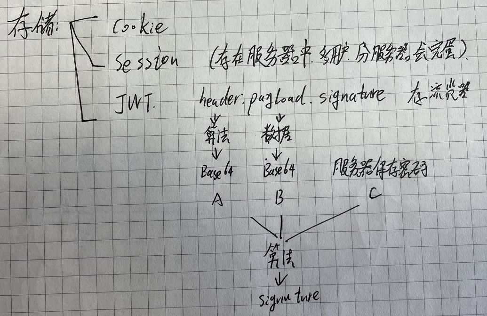

# web编程

## 从目录计划的学习点

- [ ] jianjia2模板

- [ ] Mako模板（豆瓣使用）
- [ ] REST 是啥？[笔记](./REST.md)
- [ ] jQuery、 fetch 、Ajax
- [ ] NoSQL数据库
- [ ] 部署
- [ ] Celery 消息列队
- [ ] 多线程、多进程、Gevent、Future、asyncio 五种爬虫法
- [ ] [书中代码地址](https://github.com/dongweiming/web_develop)

### 对比32页后梳理的不足

- 不熟悉缓存、消息列队的使用场景、使用方法
- 

### python开发的网站

国内的豆瓣、搜狐，国外的 Reddit、 You Tube Instagram、 Interest、 Bitbucket、 Disqus、 Dropbox等公司都选择 Python作为Web开发的语言                                

### WEB框架包括

- Django
- Flask
- Pyramid
  - 模板可切换，多种模板可共存
  - 比Django灵活，文档少
- Bottle
- Tornado
  - 每秒数以千计链接
- 小众
  - Quixote
  - Klein

### 视图开发

- Cordova (⽤于本地⼿机/平板应⽤)
- NW.js (即 Node-Webkit, ⽤于桌⾯应⽤)
- Electron (⽤于桌⾯应⽤)

## 关于用户身份确认

用户输入用户名密码后，有三种储存方式来在今后的浏览过程中识别用户：cookie、session、jsonWebToken

- `cookie` 存在浏览器中，内容可以看到
- `session` 存在服务器中，浏览器每次发送后，与服务器中的匹配一遍确认身份。当用户量贼大、服务器不只一台、数据库不只一台的时候，会造成很大问题
- `Token` 通过header、payload算法算出signature来，存在用户的浏览器中。当发送给服务器的时候，服务器通过验算来确认用户身份。

