[从零开始学架构_哔哩哔哩_bilibili](https://www.bilibili.com/video/BV17T4y1v7Ji?spm_id_from=333.999.0.0)

架构又称为软件架构，是有关软件整体结构与组件的抽象描述，用于指导大型软件系统各个方面的设计。

优秀的性能，超强的TPS/QPS ，承载力，高可用决定了能够支撑多少PV的流量

Balance ，选择一个投入产出比最优的方案

**架构师职责：**

1. 明确需求
2. 系统能力分解
3. 技术选型
4. 制定架构说明书并主导执行落地

架构师能力

架构大纲

收获

# 分层模型

看到这里[从零开始学架构_哔哩哔哩_bilibili--p2](https://www.bilibili.com/video/BV17T4y1v7Ji?p=2&spm_id_from=pageDriver) 

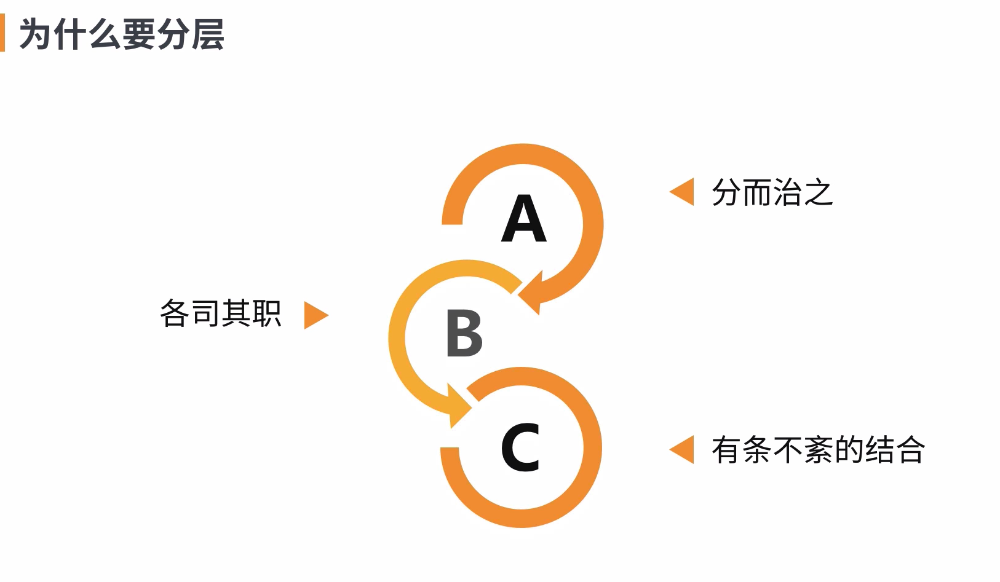

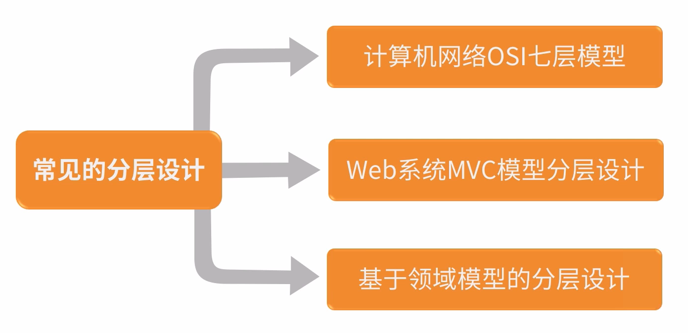

每一层解决每一层的问题

## 分层模型演进-V0.1时代

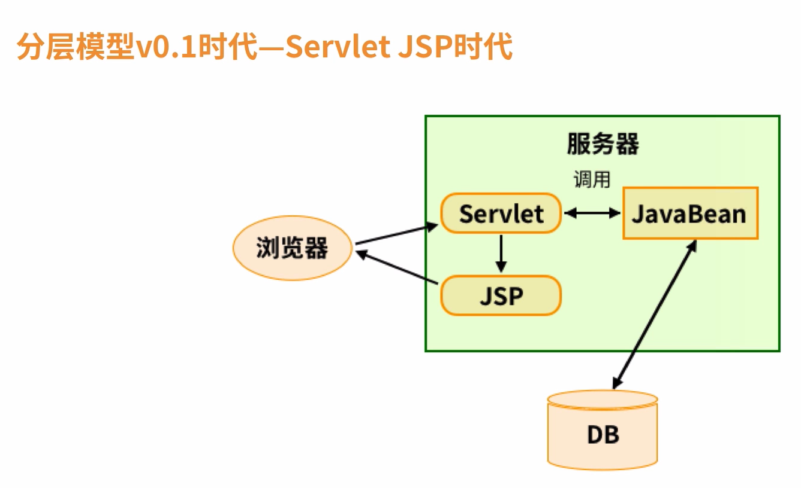

1. serlvet + tomcat容器 完成web接入
2. 使用javabean+JDBC完成数据层接入
3. 使用JSP完成页面展示

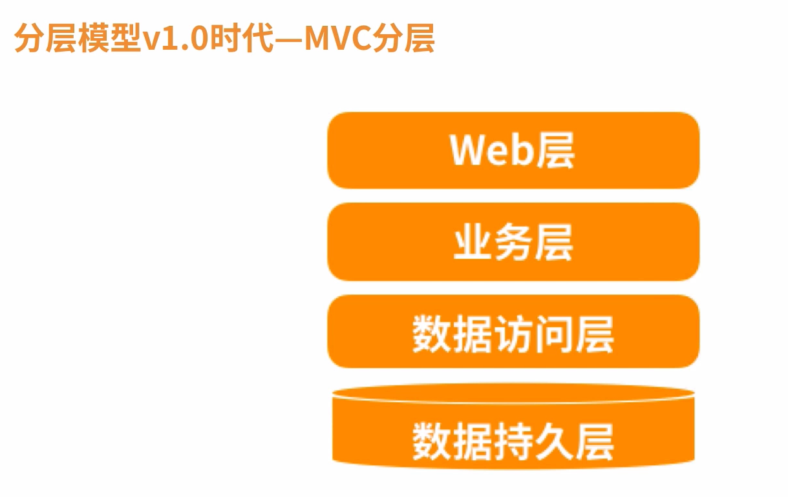

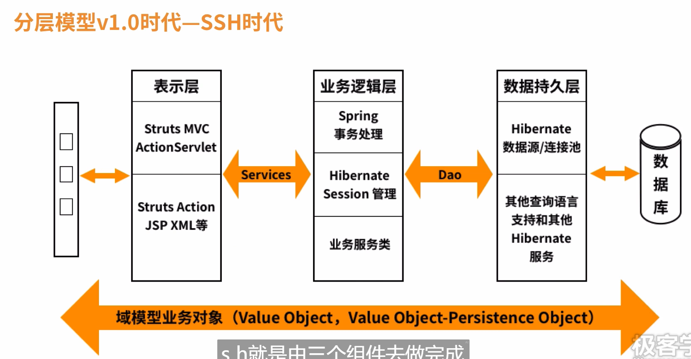

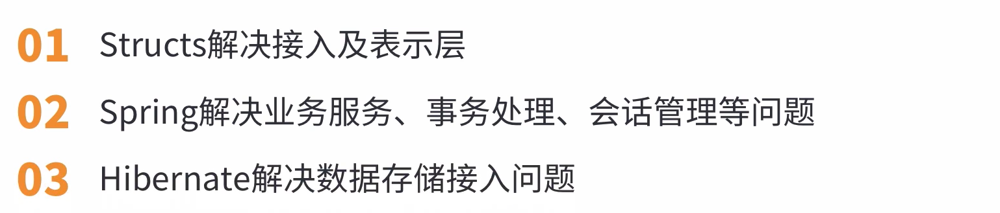

## 分层模型-V1.5时代

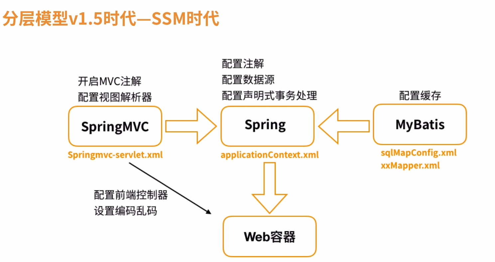

1. SpringMVC  解决接入及表示层
2. Spring          解决业务服务、事务处理、会话管理等问题
3. MyBatis       解决数据接入层

## 分层模型-V2.0时代

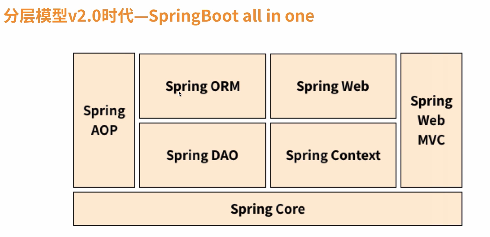

SpringBoot All in One

1. 整合了所有spring的框架功能
2. 提供了简单的配置及注解的接入方式
3. 提供all in one 的服务

问题：

1. 解决了单一应用内的软件分层，却没有解决整体应用的分层
2. 单一应用性能瓶颈，无法支撑亿级流量
3. 团队协作问题

## 分层模型-V3.0-分布式分层

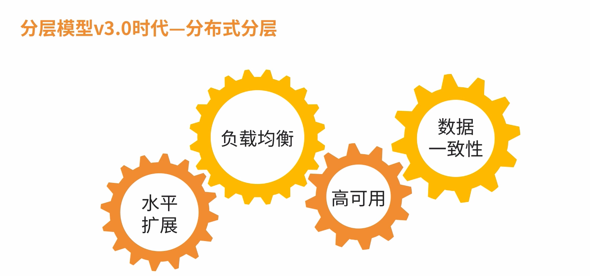

### 分布式业务概念层

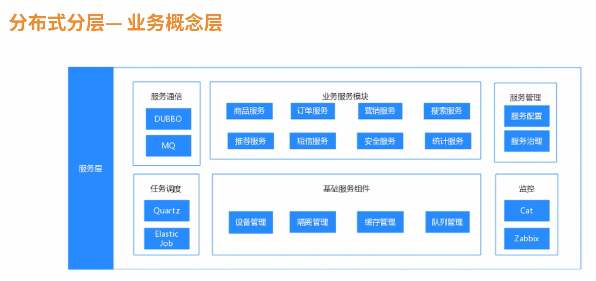

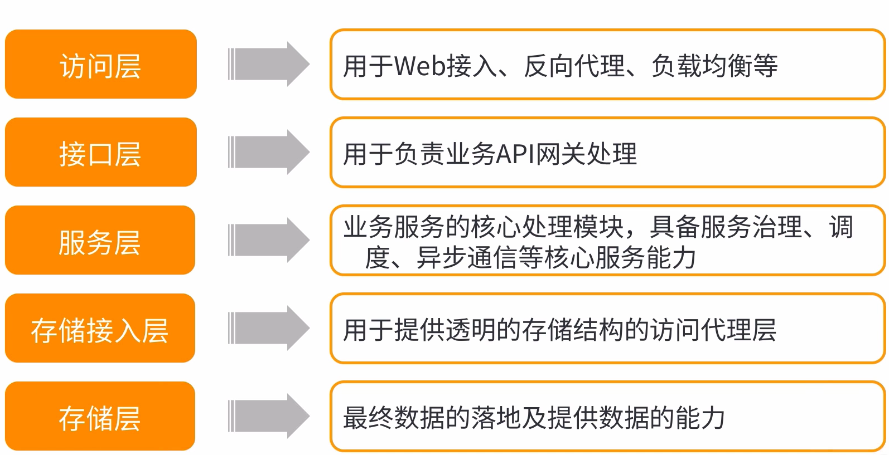

# 访问层架构设计

[从零开始学架构_哔哩哔哩_bilibili  p5](https://www.bilibili.com/video/BV17T4y1v7Ji?p=5&spm_id_from=pageDriver)